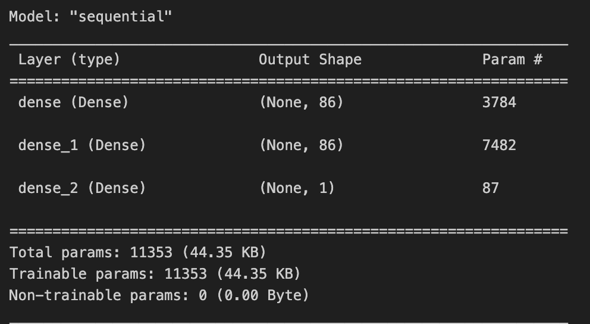
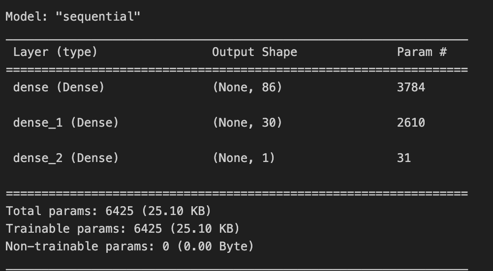
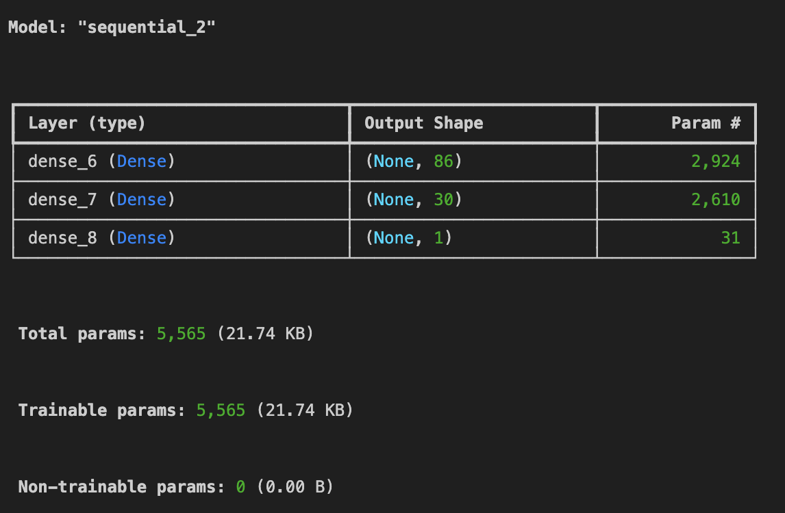

# deep-learning-challenge
The objective of this project is to create a binary classifier that predicts applicant success when backed by pledges. The pledges are provided by a charity company called Alphabet Soup. Deep learning involving neural networks was the main tool to solve this problem. A model that provided an accuracy of 75% was the goal, but even with KerasTuner, the best that was obtained was 73%. One of the tested neural networks (Optimization #2) did attempt drop a potentially unimportant column as a way to increase accuracy, but this process was not repeated with KerasTuner.

## Dataset Information and Preprocessing Steps
Below are the columns in the dataset provided by the company that includes information about the applicants and their campaign outcomes.
  * `EIN` and `NAME` — Identification columns
  * `APPLICATION_TYPE` — Alphabet Soup application type
  * `AFFILIATION` — Affiliated sector of industry
  * `CLASSIFICATION` — Government organization classification
  * `USE_CASE` — Use case for funding
  * `ORGANIZATION` — Organization type
  * `STATUS` — Active status
  * `INCOME_AMT` — Income classification
  * `SPECIAL_CONSIDERATIONS` — Special considerations for application
  * `ASK_AMT` — Funding amount requested
  * `IS_SUCCESSFUL` — Was the money used effectively

The first steps of preprocessing involved removing the EIN and NAME columns completely from the imported DataFrame. Bucketing was then used to reduced the number of values within the APPLICATION_TYPE and the CLASSIFICATION columns. Unique values with the lowest counts were relabeled as "Other".

The target component of this dataset, or what the model is being programmed to predict, is the IS_SUCCESSFUL metric. This column was converted to binary values where 0 represents an unsuccessful campaign while 1 represents a successful campaign. SPECIAL_CONSIDERATIONS were also converted to binary values, with "N" being represented by 0 and "Y" being converted to 1.

Prior to splitting the data into training and testing sets, the remaining categorical fields, such as INCOME_AMT and ORGANIZATION were converted to binary values using Pandas' `get_dummies()` method.

## Neural Network Results
### Initial Neural Network
The first neural network consisted of three layers with the first two layers using Rectified Linear Unit (ReLU) as the activation function and the final layer using the sigmod activation function. Below is a summary of that network.

After training the model with the training data, the model was tested for accuracy on the testing data. Below are its performance results.

It can be seen that the loss was over 1.05, which indicates that the model seemed to not use the data at all in its predictions, but still had an accuracy rate of 73%.
### Optimization Attempt 1
The process was repeated, only this time, the network was built with less neurons in its second layer and the number of epochs was increased from 100 to 200. Below is an image of its summary.

These are the results of this model's performance on the test data

### Optimization Attempt 2
The neural network built for this optimization attempt involved leaving much of the hyperparamters from optimization attempt #1 the same, however, as a preprocessing step, APPLICATION_TYPE was removed from the initial DataFrame and was not considered in the training/test phase. The decision to do this was made because a very large majority of submitted applications (27,037 applications of 32499) were T3 with the second most being around 1,500. Below is a summary of that neural network.

The model's performance was the same as that seen in Optimization Attempt #1.

### Optimization of Neural Network Using KerasTuner
As a final attempt at optimization, KeraTuner was introduced as a way to find the hyperparameters of the model with the best accuracy. KerasTuner uses different combinations of hyperparameters (think activation functions, number of neurons, number of layers, etc.), builds the defined neural network, and makes predictions using the test dataset. Below are the results of the best model's accuracy.

The best model determined by KerasTuning optimization had the following hyperparameters:

Documentation:
[KerasTuner](https://keras.io/guides/keras_tuner/getting_started/)
[TensorFlow](https://www.tensorflow.org/guide/keras/sequential_model)

