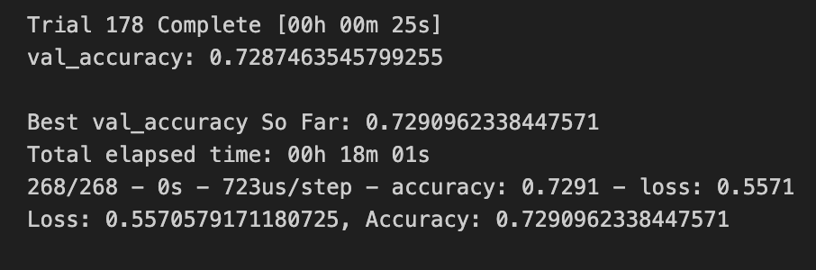
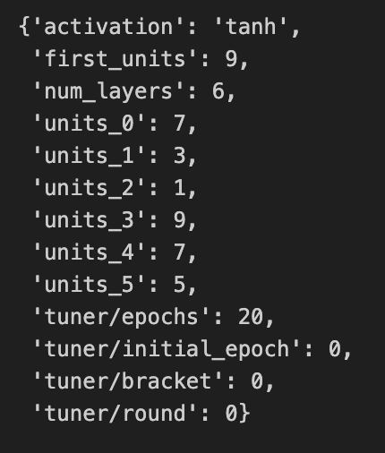

# deep-learning-challenge
The objective of this project was to create a binary classifier to predict applicant success when backed by pledges by a charity company called Alphabet Soup. Deep learning involving neural networks was the main tool to solve this problem.

## Dataset Information and Preprocessing Steps

## Neural Network Results
### Initial Neural Network

### Optimization Attempt 1

### Optimization Attempt 2

### Optimization of Neural Network Using KerasTuner

Documentation:
[KerasTuner](https://keras.io/guides/keras_tuner/getting_started/)
[TensorFlow](https://www.tensorflow.org/guide/keras/sequential_model)

